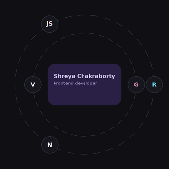

  

  Turning ideas into interfaces, one component at a time.

  

  
  
  

---

### At a glance

| | | |
|:---:|:---:|:---:|
| **12 repos** and counting | **3+ projects** built & deployed | **8.86 CGPA** CSE, RCCIIT |

---

### Toolbox

  

---

### Connect with me

  
  

